# Welcome to my page

## Table of Contents
* [Introduction](#introduction)
* [Aim and Objective](#aim-and-objective)
* [Expected outcome](#expected-outcome)
* [Materials Required](#materials-required)
  * [Wifi Module](#wifi-module)
  * [Relay Module](#relay-module)
  * [Breadboard](#breadboard)
  * [Jumper Wire](#jumper-wire)
  * [Resistor](#resistor)
  * [Transistor bc547](#transistor-bc547)
  * [Dedicated Power Supply for the Relay](#dedicated-power-supply-for-the-relay)
* [3v to 5v switch](#3v-to-5v-switch)
* [How to Setup Hardware](#how-to-setup-hardware)
* [How to Program Esp Module](#how-to-program-esp-module)
  * [Installing “CP210x USB TO UART Bridge” driver](#installing-cp210x-usb-to-uart-bridge-driver)
  * [Setting up Arduino IDE for esp module](#setting-up-arduino-ide-for-esp-module)
  * [Arduino Code](#arduino-code)
  * [Uploading the code](#uploading-the-code-to-the-esp-module)
* [Android Code](#android-code)
* [How to control the appliances/Accessing Server](#how-to-control-the-appliances)
  * [Using web browser](#using-web-browser)
  * [Using Android App](#using-android-app)
* [References](#references)
  
## Introduction
In this project we are going to make a home automation system using ESP8266 Wi-Fi module. Using this we will be able to control lights, electric fan and other home appliances through a web browser using our PC or mobile. These AC mains appliances will be connected to relays which are controlled by the ESP8266. ESP8266 acts as a Web Server and we will send control commands through a Web Browser like Google Chrome or Mozilla Firefox. ESP8266 is the one of the most popular and low cost Wi-Fi module available in the market today.

## Aim and Objective
The main Objective of our work is to automate the Home Appliances using Android Application or the Computer, basically the project is very much important for Specially challenged People who are unable to go everywhere every time to control the home appliances, for that they can be in one position and can control the home appliances.

Also for the people who are sleeping at night and are feeling lazy to either switch off/on the fan or A.C. or any of the home appliances they can turn on/off using there android phone.

Also, for the parents who fear of getting electric shocks if their children use the switch, then in that case too our project work is very useful as the child can control the home appliances using the Android Application and is safe for electric shocks.


## Expected outcome
The home appliances can be controlled with any android mobile or web browser anywhere, anytime. 
The user will have application which will allow easier operation of wifi module.
And also a webpage which will control over wifi module, if not have android mobile.
It can be controlled with any computer.

# Materials Required

## Wifi Module
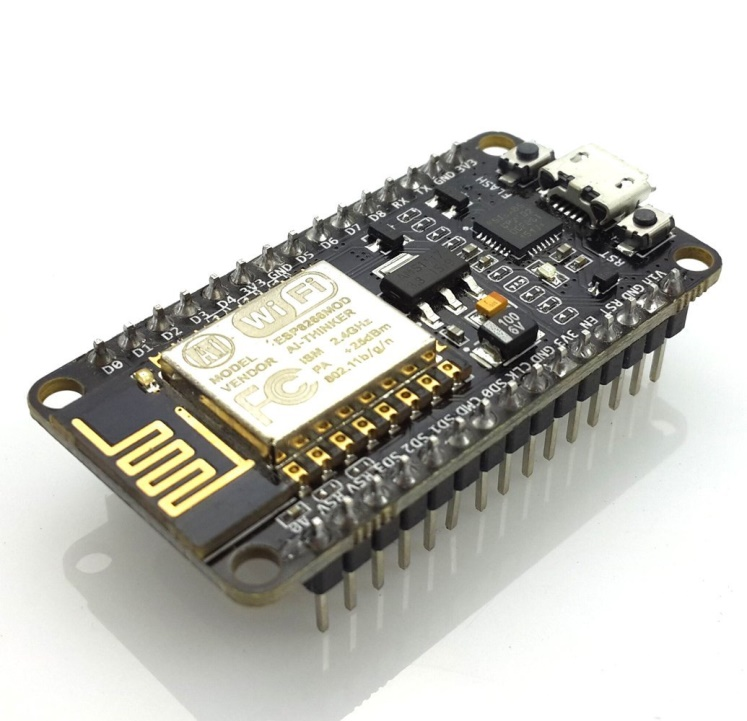
This is a Wi-Fi module which we are using in our project. Its model is “Esp8266mod” and vendor is “Ai-Thinker”. It’s an impressive, low cost Wi-Fi module suitable for adding Wi-Fi functionality to an existing microcontroller project via a UART serial connection. The module can even be reprogrammed to act as a standalone Wi-Fi connected device–just add power.

### Configuration of esp module
1.	Input Voltage = 5v
2.	Output Voltage=3.3v
3.	It has 16 GPIO pins,can be used for both input and output.
4.	It can be used as standalone module i.e no additional programmer needed to program this board.
5.	It can work in 3 modes
i)	Station Mode  :	It can connect to existing Wi-Fi Access Points.
ii)	Soft-AP Mode:	It can create Wi-Fi Access Points.
iii)	It is also able to operate both in station mode and soft Access Point Mode at the same point.

### why this module
1.Fully integrated module i.e inbuilt with programmer.
2.Can be powered by any usb cable mobile charger.
3.Easily programmed by using Arduino IDE.
4.Very low Power consumption.
5.Cost Effective.
6.Easily available in Online Shopping websites such as Amazon and Ebay.

### Pin diagram of esp
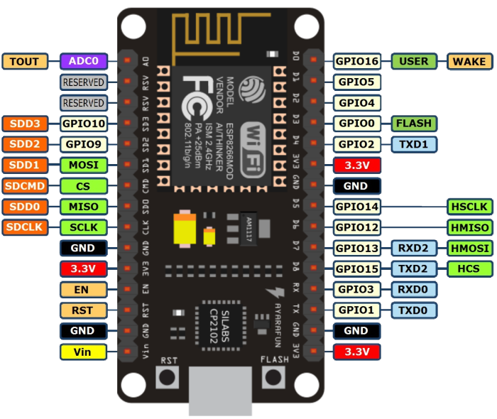


## Relay Module
This is a relay module having 4 5v relays.

### Configuration of relay Module
1.	Input Voltage:	5v.
2.	Input Current:	15-20mA .Each of the 4 relays shown above needs 15-20 mA driver current.
3.	Output Voltage:	 220v AC.
4.	Output current  :	upto 10A

### What is a relay?
We know that most of the high end industrial application devices have relays for their effective working. Relays are simple switches which are operated both electrically and mechanically. Relays consist of an electromagnet and also a set of contacts. The switching mechanism is carried out with the help of the electromagnet. There are also other operating principles for its working. But they differ according to their applications. Most of the devices have the application of relays.

### Why is a relay used?
The main operation of a relay comes in places where only a low-power signal can be used to control a circuit. It is also used in places where only one signal
can be used to control a lot of circuits.
Here we are using dc voltages in module and we are trying to connect and switch AC devices using signals sent by the Wi-Fi module. So here comes the application of relay.

### Relay Design
There are only four main parts in a relay. They are
	Electromagnet
	Movable Armature
	Switch point contacts
	Spring
*The figures given below show the actual design of a simple relay.*

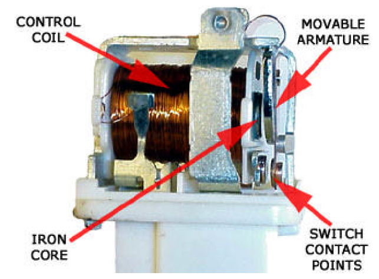
It is an electro-magnetic relay with a wire coil, surrounded by an iron core. A path of very low reluctance for the magnetic flux is provided for the movable armature and also the switch point contacts.  The movable armature is connected to the yoke which is mechanically connected to the switch point contacts. These parts are safely held with the help of a spring. The spring is used so as to produce an air gap in the circuit when the relay becomes de-energized.

### How relay works?
*The working of a relay can be better understood by explaining the following diagram given below.*

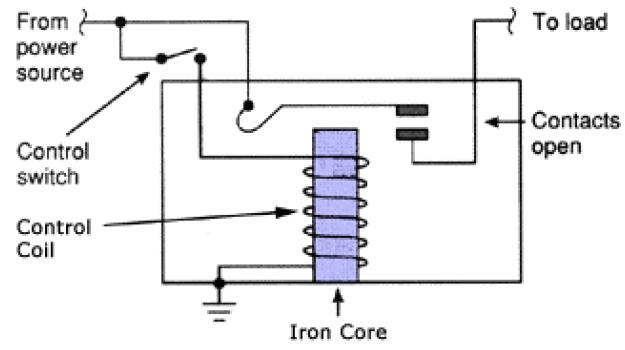

The diagram shows an inner section diagram of a relay. An iron core is surrounded by a control coil. As shown, the power source is given to the electromagnet through a control switch and through contacts to the load. When current starts flowing through the control coil, the electromagnet starts energizing and thus intensifies the magnetic field. Thus the upper contact arm starts to be attracted to the lower fixed arm and thus closes the contacts causing a short circuit for the power to the load. On the other hand, if the relay was already de-energized when the contacts were closed, then the contact move oppositely and make an open circuit.
As soon as the coil current is off, the movable armature will be returned by a force back to its initial position. This force will be almost equal to half the strength of the magnetic force. This force is mainly provided by two factors. They are the spring and also gravity.
Relays are mainly made for two basic operations. One is low voltage application and the other is high voltage. For low voltage applications, more preference will be given to reduce the noise of the whole circuit. For high voltage applications, they are mainly designed to reduce a phenomenon called arcing.

### Relay Basics

The basics for all the relays are the same. *Take a look at a 4 – pin relay shown below.* There are two colours shown. The green colour represents the control circuit and the red colour represents the load circuit. A small control coil is connected onto the control circuit. A switch is connected to the load. This switch is controlled by the coil in the control circuit. Now let us take the different steps that occour in a relay.

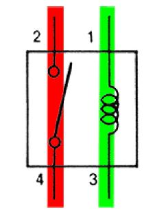

### Energized Relay (ON)

*As shown in the circuit below*, the current flowing through the coils represented by pins 1 and 3 causes a magnetic field to be aroused. This magnetic field causes the closing of the pins 2 and 4. Thus the switch plays an important role in the relay working. As it is a part of the load circuit, it is used to control an electrical circuit that is connected to it. Thus, when the relay in energized the current flow will be through the pins 2 and 4.

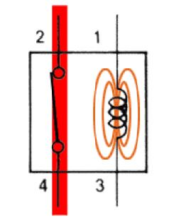

### De-Energized Relay (OFF)

As soon as the current flow stops through pins 1 and 3, the switch opens and thus the open circuit prevents the current flow through pins 2 and 4. Thus the relay becomes de-energized and thus in off position.

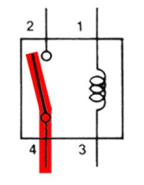

*In simple, when a voltage is applied to pin 1, the electromagnet activates, causing a magnetic field to be developed, which goes on to close the pins 2 and 4 causing a closed circuit. When there is no voltage on pin 1, there will be no electromagnetic force and thus no magnetic field. Thus the switches remain open*


## Breadboard

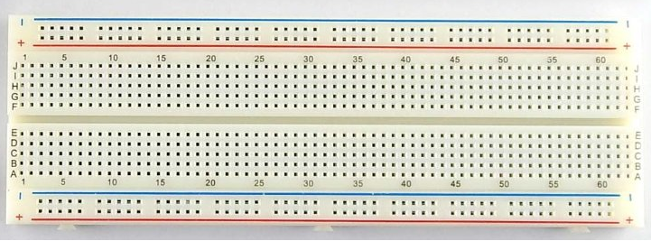

A breadboard is a construction base for prototyping of electronics.


## Jumper Wire

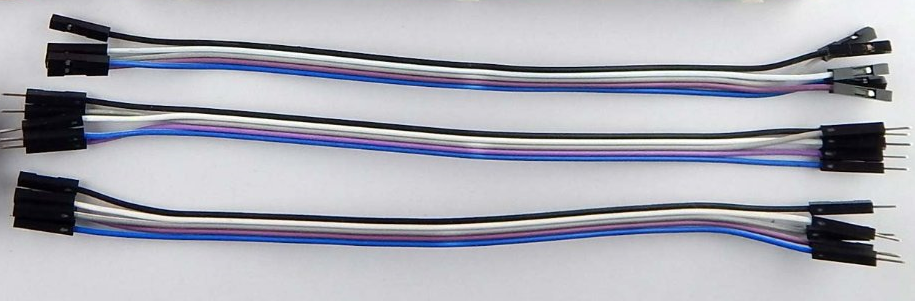

Jumper wires are the connecting wire which are breadboard and relay friendly.
They are of three types 
i)	Female to female 
ii)	Male to male 
iii)	Female to male 


## Resistor

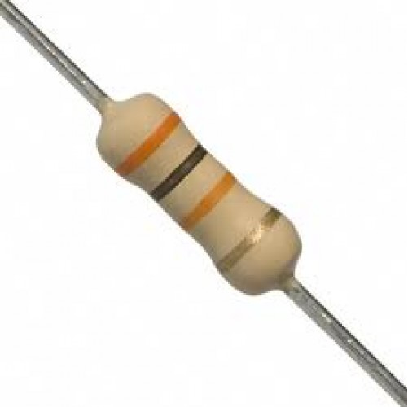

Two resistances are needed in our project.
1)	47K 
2)	1K


## Transistor bc547

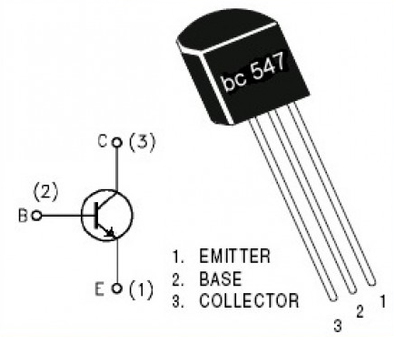

BC547 is an NPN Bi-polar junction transistor (BJT) as shown in figure. A transistor, stands for transfer of resistance, is commonly used to amplify current. A small current at its base controls a larger current at collector & emitter terminals.
Together with other electronic components, such as resistors, coils, and capacitors, it can be used as the active component for switches and amplifiers. 


## Dedicated Power Supply for the Relay

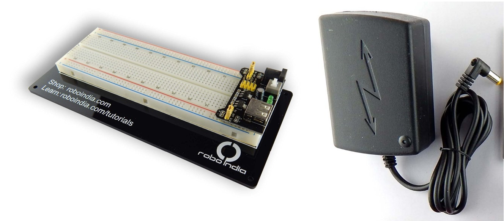

The above is the dedicated power supply circuit and the 9v dc adapter, the 9v adapter is plugged into the circuit and the circuit can give output of 5v and 3.3v and its current is sufficient enough to trigger 5v relay. It can be easily purchased from amazon and eBay.


## 3v to 5v switch

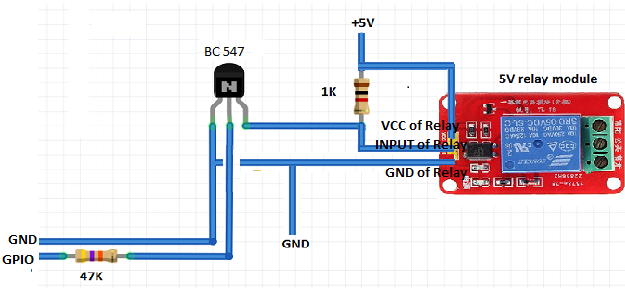

*Above is a circuit diagram of 3v to 5v switch.*
The left end is coming from Wi-Fi module.


## How to Setup Hardware

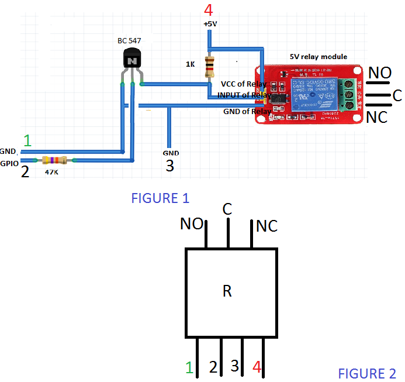

Working with 5v Relay using 3.3v signal from esp module.
**The figure 2 shows the pin configuration of figure 1 in complete.**


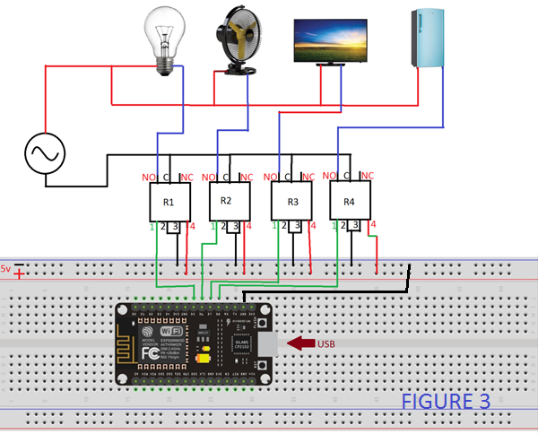

 **Figure 3 shows the complete setup of relays, Wi-Fi module and connectivity with home appliances.** 
Relays and appliances are connected with ac supply (220v). Wi-Fi module is connected with any 5v DC supply through usb. The relays should be given a power supply of 5v dc sufficient enough to trigger the relay coil and make it work. The states of Relays are normally open. When the on signal is received, the relay switches to normally closed state and appliances are turned on.


## How to Program Esp Module

### 1)	[Installing “CP210x USB TO UART Bridge” driver.](#installing-cp210x-usb-to-uart-bridge-driver)
### 2)	[Setting up Arduino IDE for esp module.](#setting-up-arduino-ide-for-esp-module)
### 3)	[Writing the Code we want.](#arduino-code)
### 4)	[Uploading the code.](#uploading-the-code-to-the-esp-module)


## Installing “CP210x USB TO UART Bridge” driver

1)	Connect the module with the computer using micro USB cable.

2)	Download driver from internet using either of these two steps:

i)	Google “CP210x USB TO UART Bridge” driver and download it.

ii)	Or just go to this link: http://www.silabs.com/products/development-tools/software/usb-to-uart-bridge-vcp-drivers and download driver according to the operating system used.

Here we are using windows so we downloaded the windows version

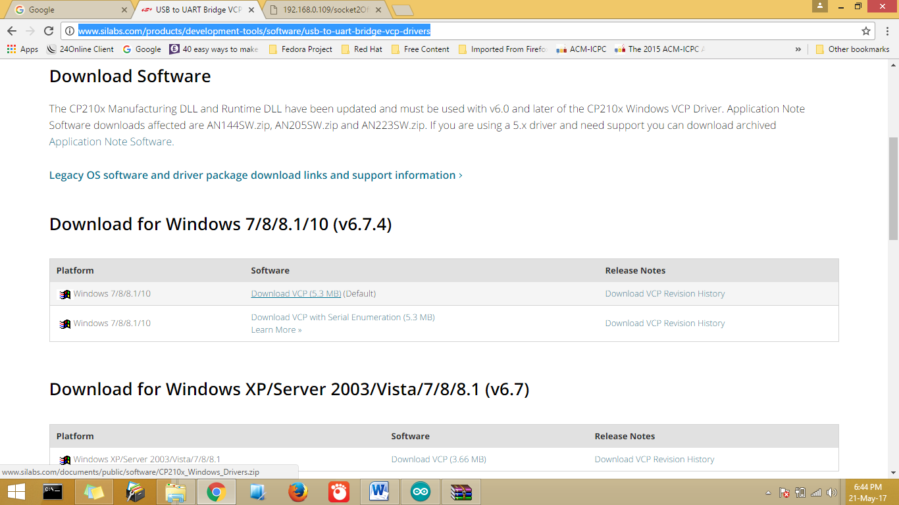

A zip file will be downloaded named “CPI210x_latest.zip”

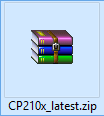

Unzip the file and install the “CPI210x_latest.exe” installer

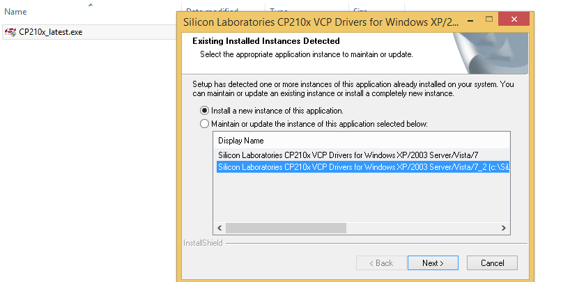

Configure the installation Path and also **REMEMBER THE PATH**

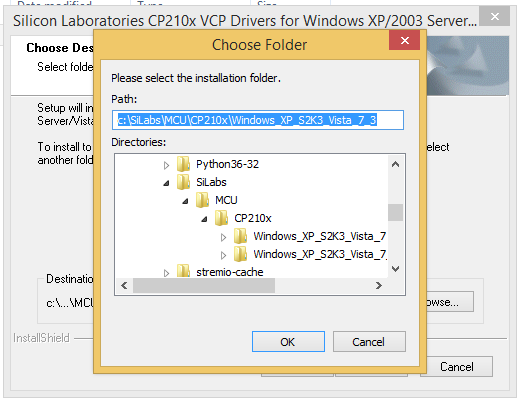

3)	To install the drivers, open the Window's Control Panel and clicked on the Device Manager. There you will find the USB controller that exists on chip. Right click on the CP120x USB Composite Controller (it has a tiny yellow caution symbol) under Other Devices.

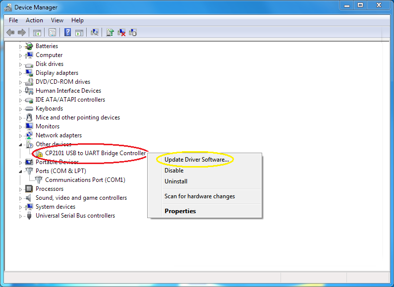

4)	Then a window will open and configure the path where we have installed the driver earlier and check that an Include subfolders checkbox is checked and click next. 

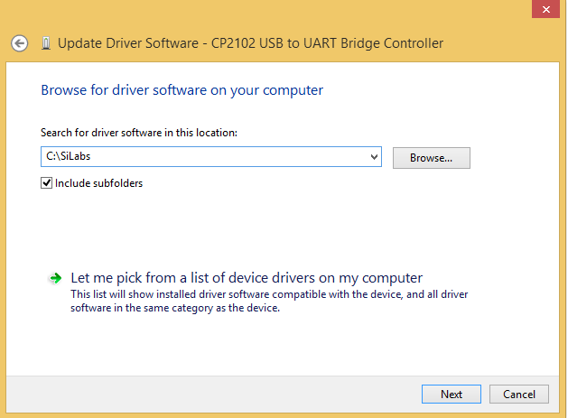

When a driver is successfully updated below message will be shown.

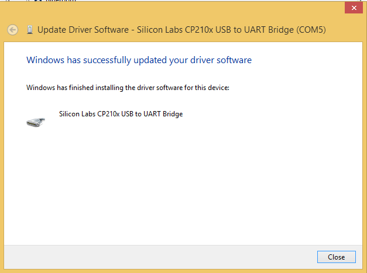

Now we can see that the “CPI210x USB to UART” is showing under Ports (COM and LPT) window which means driver is successfully installed and Configured in “COM5” in the figure shown below.

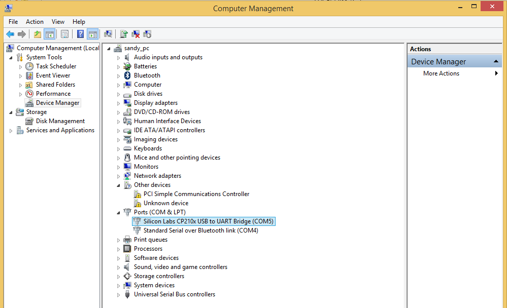

## Setting up Arduino IDE for esp module

1)	Installing Arduino IDE 

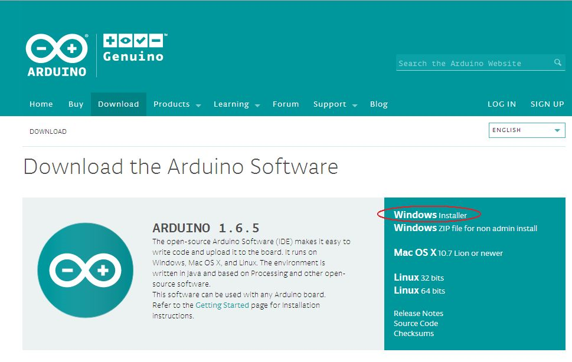

2)	Go to Preferences 

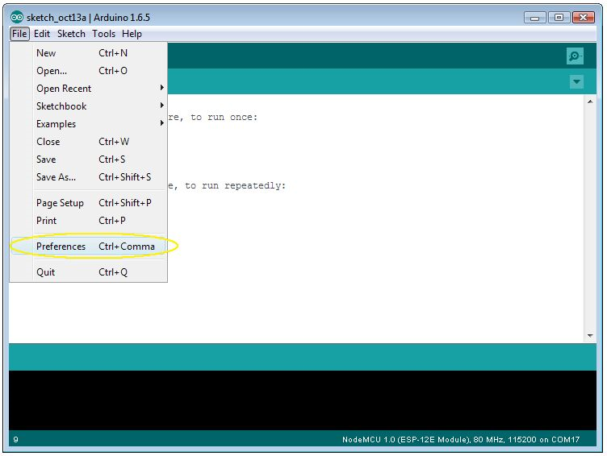

In the Preferences Dialog ,go to Additional Boards Manager URL’s and write  “http://arduino.esp8266.com/stable/package_esp8266com_index.json” in it.

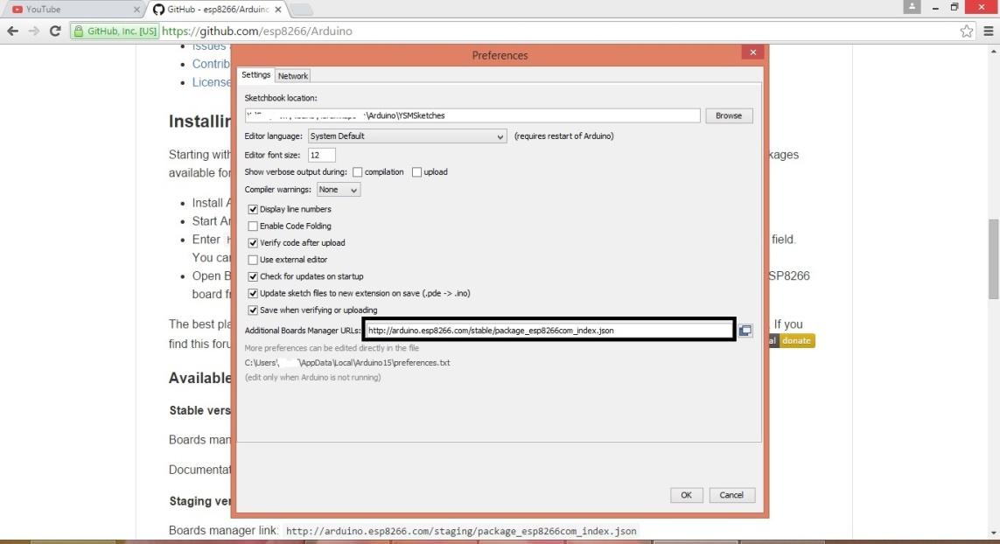

3)	Then go to Board Manager 

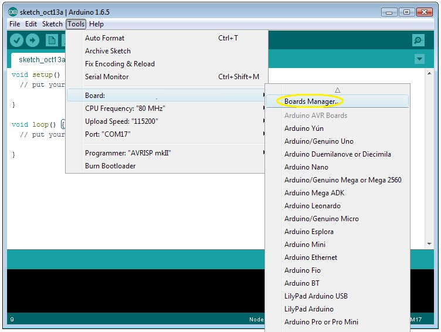

Then write “Esp8266” in the text field and hit enter.

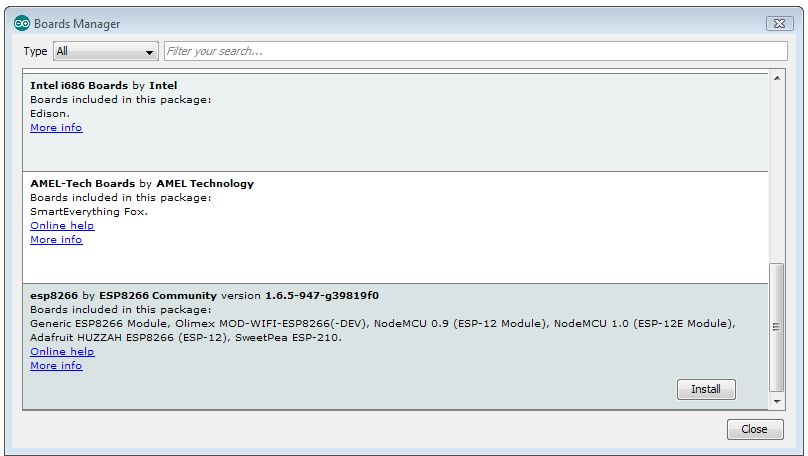

Click on esp8266 and install .

4)	Select Board “NodeMCU 1.0(ESP-12E Module)”

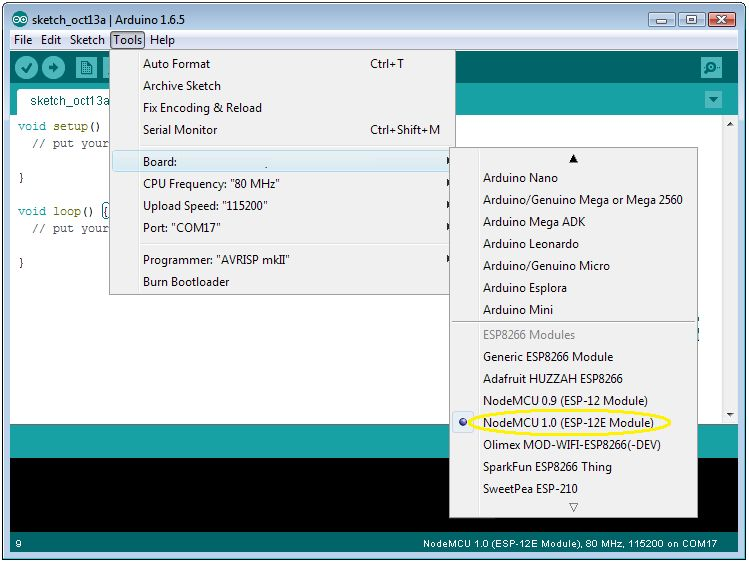

5)	Configuring COM Port: we have seen earlier that our driver is configured to “port5” so configure it to port5.

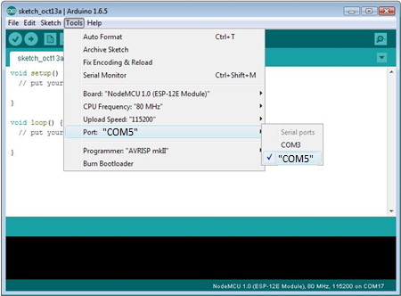

6)	Configure COM Port Speed to “115200”


And now the Arduino IDE is ready to program and upload the code.


## Arduino Code

*Here is the arduino code for our project.*

```arduino
#include <ESP8266Wi-Fi.h>                  // Libraries
#include <ESP8266WebServer.h>         // needed
int gpio1_pin = 14;     //declaring gpio1 to the pin 14 
int gpio2_pin = 12;     //declaring gpio2 to the pin 12
int gpio3_pin = 13;     //declaring gpio3 to the pin 13
int gpio4_pin = 15;     //declaring gpio4 to the pin 15

char ssid[] = "Dragon";      // your network SSID (name) 
char pass[] = "a1235789";    // your network password

IPAddress staticIp(192, 168, 0, 109);     //static ip
IPAddress gateway(192, 168, 0, 1);       //gateway
IPAddress subnet(255, 255, 255, 0);      //and subnet
    
ESP8266WebServer server(80);           //server at port 80

String webPage = "", button1 = "", button2 = "", button3 = "", button4 = "";
String a = "1",b="2",c="3",d="4";

void setup() {              //Declaration and Code which are runned once are written here
  
  Serial.begin(115200);     //serial monitor declaration at 115200 baud 
  
  webPage += "<h1>ESP8266 Web Server</h1>";                   // webPage                                                                              
  button1 += "<p>Socket #1 <a href=\"socket1On\"><button>ON</button></a>&nbsp;<a href=\"socket1Off\"><button>OFF</button></a></p>&nbsp;";         // is 
  button2 += "<p>Socket #2 <a href=\"socket2On\"><button>ON</button></a>&nbsp;<a href=\"socket2Off\"><button>OFF</button></a></p>&nbsp;";        // declared
  button3 += "<p>Socket #3 <a href=\"socket3On\"><button>ON</button></a>&nbsp;<a href=\"socket3Off\"><button>OFF</button></a></p>&nbsp;";         // here
  button4 += "<p>Socket #4 <a href=\"socket4On\"><button>ON</button></a>&nbsp;<a href=\"socket4Off\"><button>OFF</button></a></p>&nbsp;";
 
  pinMode(gpio1_pin, OUTPUT);         //  All pins
  pinMode(gpio2_pin, OUTPUT);         //  modes are
  pinMode(gpio3_pin, OUTPUT);         //  declared
  pinMode(gpio4_pin, OUTPUT);         //  as output
  
  Wi-Fi.begin(ssid, pass);                      // Connection to Wi-Fi Access Point is initiated here
  Wi-Fi.config(staticIp, gateway, subnet);        // Static IP Address is assigned here

  while (Wi-Fi.status() != WL_CONNECTED) { // dot is printed in the serial monitor
    delay(500);                                    		  // until the module gets
    Serial.print(".");                               // connected to the Wi-Fi Access Point
  }
  
  Serial.println("");
  Serial.println("Wi-Fi connected");                  // Finally the message "Wi-Fi connected" is displayed when module successfully gets connected to Access Point. 
  
  server.on("/", []() {                            
    server.send(200, "text/html",a+digitalRead(gpio1_pin)+b+digitalRead(gpio2_pin)+c+digitalRead(gpio3_pin)+d+digitalRead(gpio4_pin)+ webPage  + button1 + button2 + button3 + button4 );
  });
  
  server.on("/socket1On", []() {
    digitalWrite(gpio1_pin, HIGH);
    server.send(200, "text/html", a+digitalRead(gpio1_pin)+b+digitalRead(gpio2_pin)+c+digitalRead(gpio3_pin)+d+digitalRead(gpio4_pin)+ webPage  + button1 + button2 + button3 + button4 );
    delay(1000);
  });
  
  server.on("/socket1Off", []() {
    digitalWrite(gpio1_pin, LOW);
    server.send(200, "text/html", a+digitalRead(gpio1_pin)+b+digitalRead(gpio2_pin)+c+digitalRead(gpio3_pin)+d+digitalRead(gpio4_pin)+ webPage  + button1 + button2 + button3 + button4 );
    delay(1000);
  });
  
  server.on("/socket2On", []() {
    digitalWrite(gpio2_pin, HIGH);
    server.send(200, "text/html", a+digitalRead(gpio1_pin)+b+digitalRead(gpio2_pin)+c+digitalRead(gpio3_pin)+d+digitalRead(gpio4_pin)+ webPage  + button1 + button2 + button3 + button4 );
    delay(1000);
  });
  
  server.on("/socket2Off", []() {
    digitalWrite(gpio2_pin, LOW);
    server.send(200, "text/html", a+digitalRead(gpio1_pin)+b+digitalRead(gpio2_pin)+c+digitalRead(gpio3_pin)+d+digitalRead(gpio4_pin)+ webPage  + button1 + button2 + button3 + button4 );
    delay(1000);
  });
  
  server.on("/socket3On", []() {
    digitalWrite(gpio3_pin, HIGH);
    server.send(200, "text/html", a+digitalRead(gpio1_pin)+b+digitalRead(gpio2_pin)+c+digitalRead(gpio3_pin)+d+digitalRead(gpio4_pin)+ webPage  + button1 + button2 + button3 + button4 );
    delay(1000);
  });
  
  server.on("/socket3Off", []() {
    digitalWrite(gpio3_pin, LOW);
    server.send(200, "text/html", a+digitalRead(gpio1_pin)+b+digitalRead(gpio2_pin)+c+digitalRead(gpio3_pin)+d+digitalRead(gpio4_pin)+ webPage  + button1 + button2 + button3 + button4 );
    delay(1000);
  });
  
  server.on("/socket4On", []() {
    digitalWrite(gpio4_pin, HIGH);
    server.send(200, "text/html", a+digitalRead(gpio1_pin)+b+digitalRead(gpio2_pin)+c+digitalRead(gpio3_pin)+d+digitalRead(gpio4_pin)+ webPage  + button1 + button2 + button3 + button4 );
    delay(1000);
  });
  
  server.on("/socket4Off", []() {
    digitalWrite(gpio4_pin, LOW);
    server.send(200, "text/html", a+digitalRead(gpio1_pin)+b+digitalRead(gpio2_pin)+c+digitalRead(gpio3_pin)+d+digitalRead(gpio4_pin)+ webPage  + button1 + button2 + button3 + button4 );
    delay(1000);
  });
 
  server.begin();
  Serial.println("HTTP server started");
 
}
void loop() {                   //repeated code is written in loop()
server.handleClient();     // client request is managed here
}

```

## Uploading the code to the esp module

Hit right arrow key which is upload button as shown below with the yellow color.


The above is screen is showing that the connection to the esp module is successful and now the program is being uploaded to the esp module.
After few seconds the status “uploading” will change to “Done Uploading”
Confirming that the program is successfully uploaded.

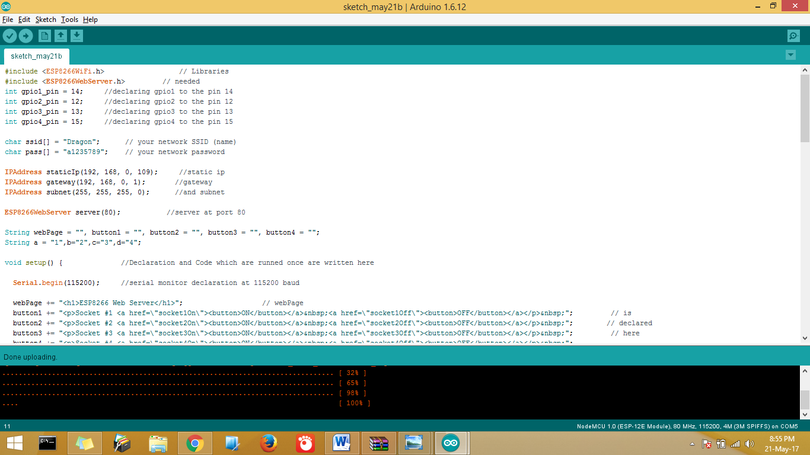


## Android Code


```

package com.example.sandy.thingspeak;

import android.app.AlertDialog;
import android.content.Context;
import android.content.DialogInterface;
import android.content.Intent;
import android.graphics.Color;
import android.nfc.Tag;
import android.os.AsyncTask;
import android.os.Bundle;
import android.os.Handler;
import android.preference.DialogPreference;
import android.support.design.widget.FloatingActionButton;
import android.support.design.widget.Snackbar;
import android.support.v7.app.AppCompatActivity;
import android.support.v7.widget.Toolbar;
import android.util.Log;
import android.view.View;
import android.view.Menu;
import android.view.MenuItem;
import android.widget.Button;
import android.widget.EditText;
import android.widget.ImageView;
import android.widget.LinearLayout;
import android.widget.ProgressBar;
import android.widget.TextView;
import android.widget.Toast;

import java.io.BufferedReader;
import java.io.InputStreamReader;
import java.net.HttpURLConnection;
import java.net.URI;
import java.net.URL;

public class MainActivity extends AppCompatActivity {
    ProgressBar progressBar1,progressBar2,progressBar3,progressBar4,progressBar5,progressBar6,progressBaroff;
    TextView textView1,textView2,textView3,textView4,textView5,textView6;
    Button button1,button2,button3, button4,button5,button6,buttonOffline,buttonIpcheck;
    ImageView imageView1,imageView2,imageView3, imageView4, imageView5,imageView6;
    EditText ip;
    int count = 0;
    private static final String URL = "http://192.168.0.109/";             
    static String newIp;

    @Override
    protected void onCreate(Bundle savedInstanceState) {
        super.onCreate(savedInstanceState);
        setContentView(R.layout.activity_main);
        Toolbar toolbar = (Toolbar) findViewById(R.id.toolbar);
        setSupportActionBar(toolbar);

        FloatingActionButton fab = (FloatingActionButton) findViewById(R.id.fab);
        fab.setOnClickListener(new View.OnClickListener() {
            @Override
            public void onClick(View view) {
                Snackbar.make(view, "Replace with your own action", Snackbar.LENGTH_LONG)
                        .setAction("Action", null).show();
            }
        });
        textView1=(TextView)findViewById(R.id.textView1);
        textView2=(TextView)findViewById(R.id.textView2);
        textView3=(TextView)findViewById(R.id.textView3);
        textView4=(TextView)findViewById(R.id.textView4);
        textView1.setText("Socket 1");
        textView2.setText("Socket 2");
        textView3.setText("Socket 3");
        textView4.setText("Socket 4");


        button1=(Button)findViewById(R.id.button1);
        button2=(Button)findViewById(R.id.button2);
        button3=(Button)findViewById(R.id.button3);
        button4=(Button)findViewById(R.id.button4);
        button5=(Button)findViewById(R.id.button5);
        button6=(Button)findViewById(R.id.button6);
        buttonIpcheck=(Button)findViewById(R.id.ipcheck);

        buttonOffline.setVisibility(View.GONE);
         progressBar1=(ProgressBar)findViewById(R.id.progressBar1);
        progressBar2=(ProgressBar)findViewById(R.id.progressBar2);
        progressBar3=(ProgressBar)findViewById(R.id.progressBar3);
        progressBar4=(ProgressBar)findViewById(R.id.progressBar4);
        progressBaroff=(ProgressBar)findViewById(R.id.progressBarO);
        progressBaroff.setVisibility(View.GONE);

        imageView1 = (ImageView)findViewById(R.id.imageView1);
        imageView1.setImageResource(R.drawable.bulb);

        imageView2 = (ImageView)findViewById(R.id.imageView2);
        imageView2.setImageResource(R.drawable.bulb);

        imageView3 = (ImageView)findViewById(R.id.imageView3);
        imageView3.setImageResource(R.drawable.bulb);

        imageView4 = (ImageView)findViewById(R.id.imageView4);
        imageView4.setImageResource(R.drawable.bulb);

        ip=(EditText)findViewById(R.id.ip);
        ip.setText(URL);
        newIp=ip.getText().toString();

        new FetchingOffline("").execute("");

        button1.setOnClickListener(new View.OnClickListener() {
            @Override
            public void onClick(View v) {
                progressBar1.setVisibility(View.VISIBLE);
                button1.setEnabled(false);
                String status = button1.getText().toString();
                newIp=ip.getText().toString();

                if (status.contentEquals("Off")) {
                    new UpdatingData1("socket1On").execute("socket1On");
                } else if (status.contentEquals("On")) {
                    new UpdatingData1("socket1Off").execute("socket1Off");
                }
            }
        });
        button2.setOnClickListener(new View.OnClickListener() {
            @Override
            public void onClick(View v) {
                progressBar2.setVisibility(View.VISIBLE);
                button2.setEnabled(false);
                String status=button2.getText().toString();
                newIp=ip.getText().toString();
                if (status.contentEquals("Off")) {
                    new UpdatingData1("socket2On").execute("socket2On");
                } else if (status.contentEquals("On")) {
                    new UpdatingData1("socket2Off").execute("socket2Off");
                }
            }
        });

        button3.setOnClickListener(new View.OnClickListener() {
            @Override
            public void onClick(View v) {
                progressBar3.setVisibility(View.VISIBLE);
                button3.setEnabled(false);
                String status=button3.getText().toString();
                newIp=ip.getText().toString();
                if (status.contentEquals("Off")) {
                    new UpdatingData1("socket3On").execute("socket3On");
                } else if (status.contentEquals("On")) {
                    new UpdatingData1("socket3Off").execute("socket3Off");
                }
            }
        });
        button4.setOnClickListener(new View.OnClickListener() {
            @Override
            public void onClick(View v) {
                progressBar4.setVisibility(View.VISIBLE);
                button4.setEnabled(false);
                String status=button4.getText().toString();
                newIp=ip.getText().toString();

                if (status.contentEquals("Off")) {
                    new UpdatingData1("socket4On").execute("socket4On");
                } else if (status.contentEquals("On")) {
                    new UpdatingData1("socket4Off").execute("socket4Off");
                }
            }
        });
        button5.setOnClickListener(new View.OnClickListener() {
            @Override
            public void onClick(View v) {
                progressBar1.setVisibility(View.VISIBLE);
                button1.setEnabled(false);
                progressBar2.setVisibility(View.VISIBLE);
                button2.setEnabled(false);
                progressBar3.setVisibility(View.VISIBLE);
                button3.setEnabled(false);
                progressBar4.setVisibility(View.VISIBLE);
                button4.setEnabled(false);
                newIp=ip.getText().toString();


                new UpdatingData1("socket4Off").execute("socket4Off");
                new UpdatingData1("socket3Off").execute("socket3Off");
                new UpdatingData1("socket2Off").execute("socket2Off");
                new UpdatingData1("socket1Off").execute("socket1Off");


            }
        });
        button6.setOnClickListener(new View.OnClickListener() {
            @Override
            public void onClick(View v) {
                progressBar1.setVisibility(View.VISIBLE);
                button1.setEnabled(false);
                progressBar2.setVisibility(View.VISIBLE);
                button2.setEnabled(false);
                progressBar3.setVisibility(View.VISIBLE);
                button3.setEnabled(false);
                progressBar4.setVisibility(View.VISIBLE);
                button4.setEnabled(false);
                newIp=ip.getText().toString();

                new UpdatingData1("socket4On").execute("socket4On");
                new UpdatingData1("socket3On").execute("socket3On");
                new UpdatingData1("socket2On").execute("socket2On");
                new UpdatingData1("socket1On").execute("socket1On");

                            }
        });

        buttonIpcheck.setOnClickListener(new View.OnClickListener() {
            @Override
            public void onClick(View v) {
                newIp=ip.getText().toString();
                new FetchingOffline("").execute("");
            }
        });
    }
    class FetchingOffline extends AsyncTask<String, Void, String>{
        String string="";
        String field="";
        String butt="";
        public FetchingOffline(String str)
        {
            this.string=str;
        }
        @Override
        protected void onPreExecute() {
            super.onPreExecute();

        }

        @Override
        protected String doInBackground(String... str) {
            try {
                URL url1=new URL(""+newIp+string+"");
                HttpURLConnection httpURLConnection=(HttpURLConnection)url1.openConnection();
                BufferedReader bufferedReader = new BufferedReader(new InputStreamReader(httpURLConnection.getInputStream()));
                StringBuilder stringBuilder = new StringBuilder();
                String line;
                while ((line = bufferedReader.readLine()) != null) {
                    stringBuilder.append(line);
                }
                bufferedReader.close();
                return stringBuilder.toString();

            }catch (Exception e)
            {
                return "net";
            }
        }

        @Override
        protected void onPostExecute(String response) {
            if (response.contentEquals("net"))
            {
                buttonIpcheck.setText("Retry");
                return;
            }
            else if(response == null) {


                Toast.makeText(MainActivity.this, "Error Fetching data", Toast.LENGTH_SHORT).show();
                return;
            }
            else {
                if (response.charAt(1) == '0') {
                    buttonIpcheck.setText("Success");
                    progressBar1.setVisibility(View.GONE);
                    button1.setEnabled(true);
                    button1.setText("Off");
                    imageView1.setImageResource(R.drawable.bulboff);
                }
                if (response.charAt(3) == '0') {
                    buttonIpcheck.setText("Success");
                    progressBar2.setVisibility(View.GONE);
                    button2.setEnabled(true);
                    button2.setText("Off");
                    imageView2.setImageResource(R.drawable.bulboff);
                }
                if (response.charAt(5) == '0') {
                    buttonIpcheck.setText("Success");
                    progressBar3.setVisibility(View.GONE);
                    button3.setEnabled(true);
                    button3.setText("Off");
                    imageView3.setImageResource(R.drawable.bulboff);

                }
                if (response.charAt(7) == '0') {
                    buttonIpcheck.setText("Success");
                    progressBar4.setVisibility(View.GONE);
                    button4.setEnabled(true);
                    button4.setText("Off");
                    imageView4.setImageResource(R.drawable.bulboff);
                }
                if (response.charAt(1) == '1') {
                    buttonIpcheck.setText("Success");
                    progressBar1.setVisibility(View.GONE);
                    button1.setEnabled(true);
                    button1.setText("On");
                    imageView1.setImageResource(R.drawable.bulbon);

                }
                if (response.charAt(3) == '1') {
                    buttonIpcheck.setText("Success");
                    progressBar2.setVisibility(View.GONE);
                    button2.setEnabled(true);
                    button2.setText("On");
                    imageView2.setImageResource(R.drawable.bulbon);

                }
                if (response.charAt(5) == '1') {
                    buttonIpcheck.setText("Success");
                    progressBar3.setVisibility(View.GONE);
                    button3.setEnabled(true);
                    button3.setText("On");
                    imageView3.setImageResource(R.drawable.bulbon);

                }
                if (response.charAt(7) == '1') {
                    buttonIpcheck.setText("Success");
                    progressBar4.setVisibility(View.GONE);
                    button4.setEnabled(true);
                    button4.setText("On");
                    imageView4.setImageResource(R.drawable.bulbon);
                }
                            }
        }
    }
    class UpdatingData1 extends AsyncTask<String, Void, String>{
        String string="";

        public UpdatingData1(String str)
        {
            this.string=str;
        }
        @Override
        protected void onPreExecute() {
            super.onPreExecute();
        }

        @Override
        protected String doInBackground(String... str) {
            try {
                URL url1=new URL(""+newIp+string+"");
                HttpURLConnection httpURLConnection=(HttpURLConnection)url1.openConnection();
                BufferedReader bufferedReader = new BufferedReader(new InputStreamReader(httpURLConnection.getInputStream()));
                StringBuilder stringBuilder = new StringBuilder();
                String line;
                while ((line = bufferedReader.readLine()) != null) {
                    stringBuilder.append(line);
                }
                bufferedReader.close();
                return stringBuilder.toString();
            }catch (Exception e)
            {
                return "net";
            }
        }

        @Override
        protected void onPostExecute(final String response) {
            if (response.contentEquals("net"))
            {
                buttonIpcheck.setText("Retry");

                buttonIpcheck.setText("Retry");
                Toast.makeText(MainActivity.this, "Error Fetching data", Toast.LENGTH_SHORT).show();
                return;
            }
            else {
                if (response.charAt(1) == '0') {
                    new FetchingOffline("").execute("");

                }
                if (response.charAt(3) == '0') {
                    new FetchingOffline("").execute("");
                }
                if (response.charAt(5) == '0') {
                    new FetchingOffline("").execute("");
                }
                    new FetchingOffline("").execute("");
                }
                if (response.charAt(1) == '1') {
                    new FetchingOffline("").execute("");

                }
                if (response.charAt(3) == '1') {

                    new FetchingOffline("").execute("");

                }
                if (response.charAt(5) == '1') {
                    new FetchingOffline("").execute("");

                }
                if (response.charAt(7) == '1') {
                    new FetchingOffline("").execute("");
                }
              }
    }


    @Override
    public boolean onCreateOptionsMenu(Menu menu) {
        // Inflate the menu; this adds items to the action bar if it is present.
        getMenuInflater().inflate(R.menu.menu_main, menu);
        return true;
    }

    @Override
    public boolean onOptionsItemSelected(MenuItem item) {
        // Handle action bar item clicks here. The action bar will
        // automatically handle clicks on the Home/Up button, so long
        // as you specify a parent activity in AndroidManifest.xml.
        int id = item.getItemId();

        //noinspection SimplifiableIfStatement
        if (id == R.id.action_settings) {

            return true;
        }

        return super.onOptionsItemSelected(item);
    }


   @Override
    protected void onResume() {
        super.onResume();

        newIp=ip.getText().toString();
        new FetchingOffline("").execute("");

    }
    private void showSnack(boolean isConnected) {
        Snackbar snackbar = Snackbar
                .make(findViewById(R.id.fab), message, Snackbar.LENGTH_LONG);

        View sbView = snackbar.getView();
        TextView textView = (TextView) sbView.findViewById(android.support.design.R.id.snackbar_text);
        textView.setTextColor(color);
        snackbar.show();
    }


```

##  How to control the appliances

To access the web server the device should be connected to the same network.
There are two ways to access the web server
1)	Using web browser
2)	Using android app

### Using web browser

Type the ip address of the module in the web browser. we have used
Ip “192.168.0.109” while  writing arduino code. Here we are using “192.168.0.109”  in the web browser

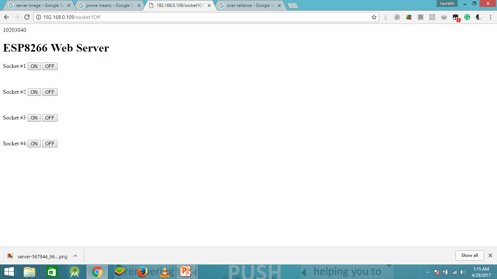

### Using Android App

Below is the picture of the Android App developed by us. Using the buttons given u can toggle appliances on or off. Here button 1 is labeled “ON” and light is lit in the right hand side of button 1 showing that the first appliance is ON. While all the rest buttons are OFF.
Two more buttons are given below a) Turn off all: to turn all devices off.
b) Turn on all: to turn on all devices.
 
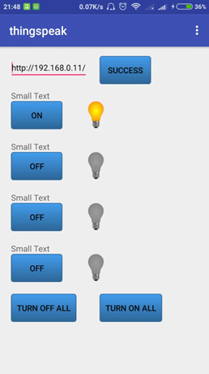

## References

1)	Esp8266 Github community. for all the documentation of esp8266.
2)	Wikipedia for the basic information.
3)	developer.android.com  i.e Android Developer by Google. for all the documentation on android.
